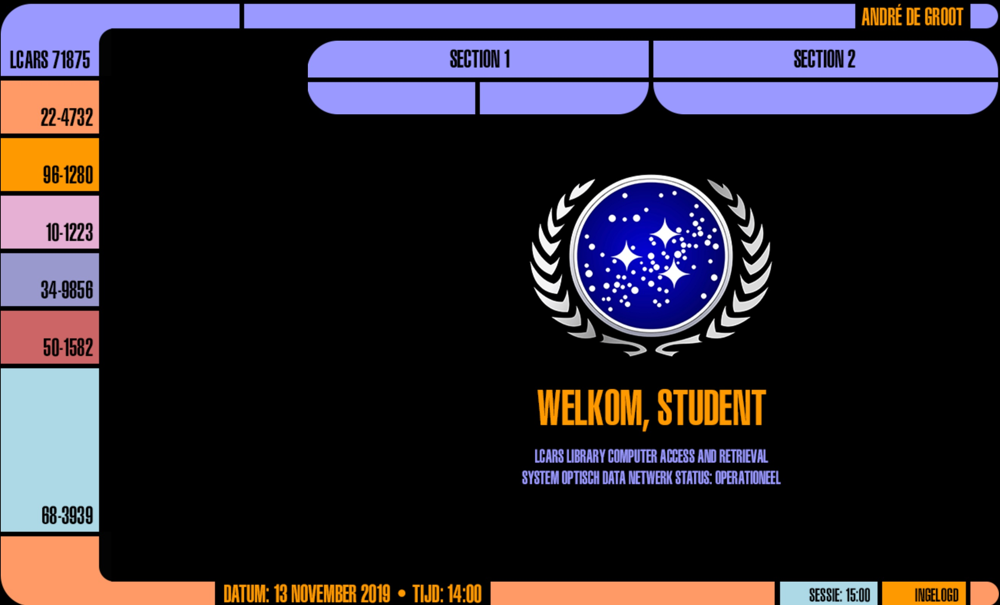

# College of Multimedia Opdracht HE-2 

__Opdrachtomschrijving__

Maak een kleine website met een zelf ontworpen interface. 

__Omschrijving__

Voor deze opdracht hebben we Photoshop CC gebruikt om pixel precieze slices te maken en deze daarna interactief te maken met HTML.

Voor deze opdracht heb ik de LCARS interface uit Star Trek nagemaakt.

[Live Demo LCARS interface Star Trek](https://cmm-web-design-module-1-he-2.netlify.app)

